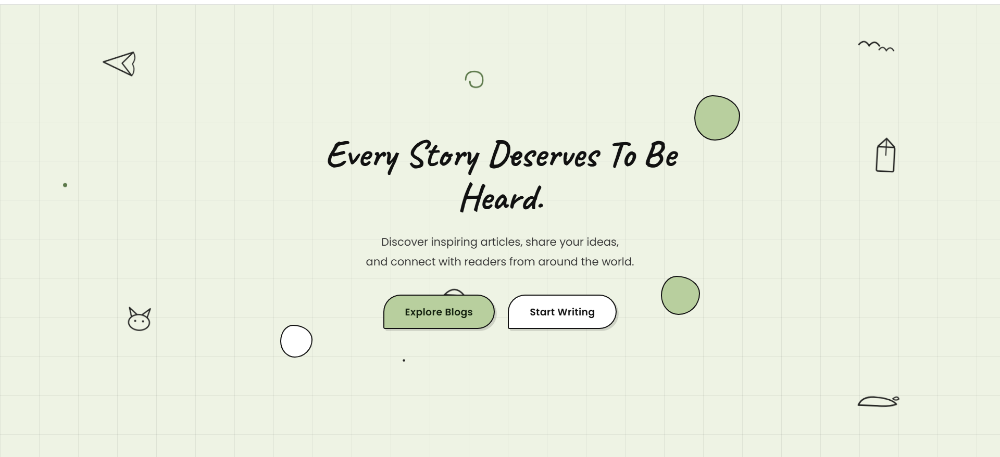
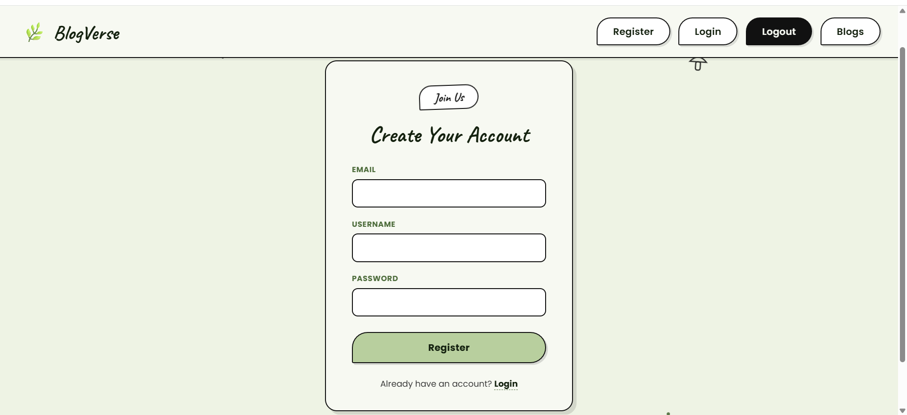
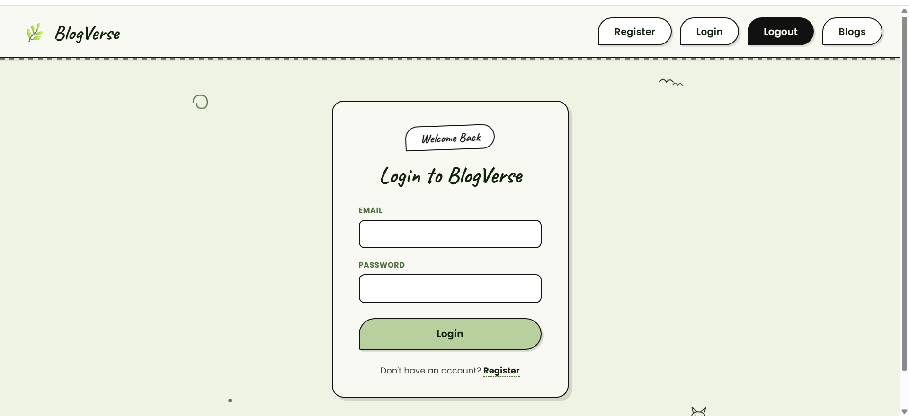
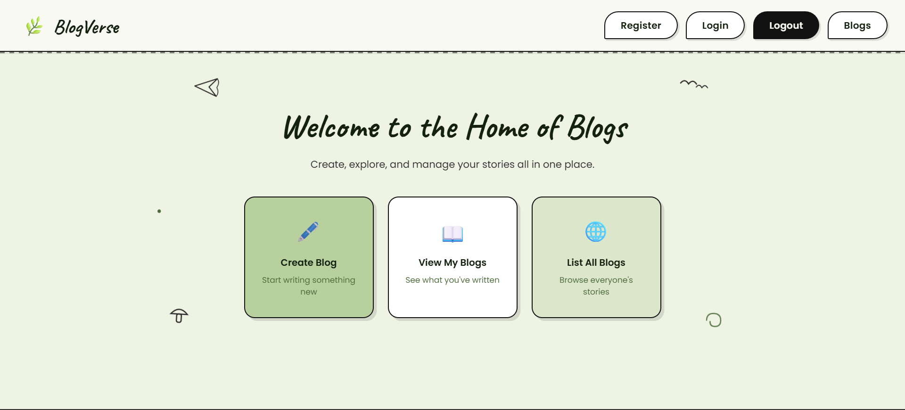

# BlogVerse ✒️

> **A modern blogging platform built with Flask where users can create, manage, and discover stories.**

BlogVerse is a full-stack web application that enables users to register, log in securely, write blogs, organize them into categories, edit or delete their own posts, and explore articles written by other users.

---

## ✨ Features

- 🔐 Secure User Authentication (Register & Login)
- 🔑 Password Hashing using Werkzeug
- 👤 User Session Management with Flask-Login
- ✒️ Create Blog Posts
- 📝 Edit & Delete Personal Blogs
- 📚 View Your Published Blogs
- 🌍 Browse Blogs from All Users
- 🏷️ Category-Based Blog Organization
- 👁️ Blog Read Count Tracking
- ⭐ Blog Rating System
- 💬 Comment on Blogs
- 📱 Responsive User Interface

---

## 🛠️ Built With

- Python
- Flask
- Flask-SQLAlchemy
- Flask-Login
- SQLite
- HTML5
- CSS3
- Jinja2

---

## 📂 Project Structure

```text
UserBlog/
│
├── instance/
│   └── data.db
│
├── templates/
│   ├── base.html
│   ├── home.html
│   ├── login.html
│   ├── register.html
│   ├── blogs_home.html
│   ├── create_blog.html
│   ├── list_all_blogs.html
│   ├── view_blog.html
│   ├── blog_detail.html
│   └── self_blog_detail.html
│
├── models.py
├── routes.py
├── requirements.txt
├── .gitignore
└── README.md
```

---

## 🚀 Getting Started

### Clone the repository

```bash
git clone https://github.com/sruthy405/BlogVerse.git
```

### Navigate into the project

```bash
cd BlogVerse
```

### Create a virtual environment

```bash
python -m venv flask_env
```

### Activate the environment

**Windows**

```bash
flask_env\Scripts\activate
```

### Install dependencies

```bash
pip install -r requirements.txt
```

### Run the application

```bash
python routes.py
```

Open your browser:

```
http://127.0.0.1:5000/
```

---

## 🗄️ Database

BlogVerse uses **SQLite** as its database.

If you're using a fresh database, create the following categories before creating blogs:

- Technology
- Movies
- Music
- Travel

---

## 📸 Application Preview

### 🏠 Home Page



---

### 📝 Register



---

### 🔐 Login



---

### 📚 Blog Dashboard


---

### ✍️ Create Blog


---

### 📖 Blog Details




---

## 🔮 Future Enhancements

- 🔍 Search Blogs
- ❤️ Like Blogs
- 🔖 Bookmark Blogs
- 🖼️ Blog Cover Images
- 👤 User Profiles
- 📄 Pagination
- 🛡️ Admin Dashboard
- 🔄 Password Reset
- 🌐 REST API
- ☁️ Deploy to Render

---

## 👩‍💻 Author

**Sruthy Sojan**

GitHub: https://github.com/sruthy405

LinkedIn: https://www.linkedin.com/in/sruthys444

---

## 📄 License

This project was developed for learning, portfolio, and educational purposes.
=======
# BlogVerse
A UserBlog to  share articles and thoughts
>>>>>>> c0c13ba6209c573c40dbda95f283a98669bb857f
